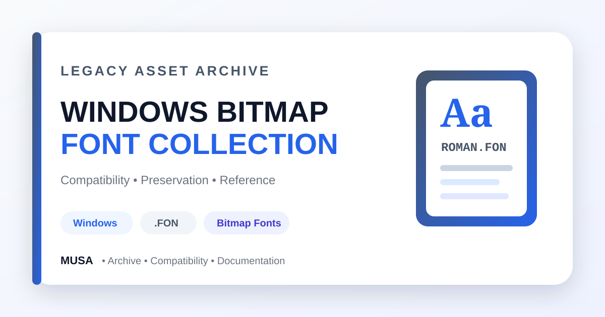

<div align="center">



# Legacy Windows Bitmap Font Collection

### A compact collection of legacy Windows `.FON` bitmap and system font resources preserved for compatibility, testing, and archival reference.


[](https://github.com/samusa099)


[](https://github.com/samusa099/fonts)
[](https://github.com/samusa099/fonts/commits/main)

</div>

---

## 📌 Overview

A documented archive of legacy Windows bitmap and system font resources intended for controlled compatibility testing, migration research, virtual machines, and preservation work.

## 📚 Documentation

| Resource | Description |
|---|---|
| [**HOW_TO_USE.md**](HOW_TO_USE.md) | Compatibility, backup, testing, installation caution, file map, and licensing guidance |
| [**Repository Cover**](assets/repository-cover.svg) | Scalable professional archive cover used in this README |

## ✨ Collection Highlights

- Courier, Roman, Script, Serif, and Small resources
- VGA system and fixed-width font files
- Code-page 850 compatible assets
- Direct-download binary files
- Compatibility and archival reference value

## 🗂️ Repository Structure

```text
fonts/
├── APP850.FON
├── COURE.FON
├── MODERN.FON
├── ROMAN.FON
├── SCRIPT.FON
├── SERIFE.FON
├── SMALLE.FON
├── SSERIFE.FON
├── VGA850.FON
├── VGAFIX.FON
├── VGASYS.FON
├── assets/
│   └── repository-cover.svg
├── HOW_TO_USE.md
└── README.md
```

## 📥 Safe Use

1. Keep an untouched backup.
2. Test only in a compatible virtual machine or isolated environment.
3. Document the operating system and target application.
4. Confirm licensing and redistribution rights before packaging any file.

> Modern browsers and operating systems may not support `.FON` resources directly.

## 👤 Author

<div align="center">

### Musa

**Internationally certified HR professional and data analytics practitioner from Bangladesh.**  
Musa combines people operations, Excel, Power BI, SQL, and technology-driven problem-solving to build practical, structured, and user-focused projects.

[](https://github.com/samusa099)

</div>
